## Install Rust and the Rust toolchain

#####  1.Install `rustup` by running the following command: 

` curl https://sh.rustup.rs -sSf | sh `

##### 2.Configure your current shell to reload your PATH environment variable so that it includes the Cargo `bin` directory by running the following command: 

` source ~/.cargo/env `

##### 3.Configure the Rust toolchain to default to the latest `stable` version by running the following commands: 

`rustup default stable`

`rustup update`

##### 4. Add the `nightly` release and the `nightly` WebAssembly (`wasm`) targets by running the following commands: 

`rustup update nightly`

`rustup target add wasm32-unknown-unknown --toolchain nightly`

##### 5. Verify your installation by running the following commands: 

`rustc --version`
`rustup show`

## Setup RainbowDao Protocol Node

### 1. Installing The Substrate Contracts Node

 We need to use a Substrate node with the built-in `pallet-contracts` pallet. For this workshop we'll use a pre-configured Substrate node client. 

`cargo install contracts-node --git https://github.com/paritytech/substrate-contracts-node.git --tag v0.3.0 --force --locked`

### 2. ink! CLI

```
# For Ubuntu or Debian users
sudo apt install 
# For MacOS users
brew install binaryen
```

#### cargo-contract

`cargo install cargo-contract --vers 0.15.0 --force --locked`

### 3. Running a Substrate Smart Contracts Node

` substrate-contracts-node --dev --tmp `


## Setup Contracts

RainbowDao Protocol Contracts are provided in `https://github.com/RainbowcityFoundation/RainbowDAO-Protocol-Ink-milestone_2.git`. 

It's developed with ink!.

### Get contracts

```
git clone git@github.com:RainbowcityFoundation/RainbowDAO-Protocol-Ink-milestone_2.git
```


## Compile contracts from source code

The RainbowDAO-Protocolprovides script to simplify the contract compilation process while collecting the editing results into a unified directory to facilitate contract deployment and usage. Execute in the project root directory

```bash
bash ./build.sh
```

All contract compilation results are saved in the release directory.

### Compile  one by one 

##### compile

` cargo +nightly contract build`

In RainbowDAO-Protocol-Ink-milestone_2 project 

erc20 > dao_category > dao_proposal > dao_setting > dao_users > dao_vault > template_manager  > dao_manager > dao_factory

## Deploy

The RainbowDao Protocol creates the substrate chain to connect the POLKADOT Ecology, and all contracts are deployed on the RainbowDao Protocol chain. This section explains how to make use of Polkadot JS App to deploy contracts.

Use `https://polkadot.js.org/apps/` upload target/ink .contract file to deploy contract.

#### 1.set the node IP and port ( `ws://127.0.0.1:9944` default).

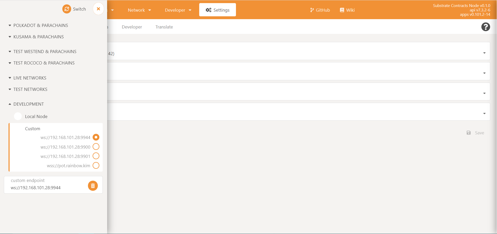

#### Upload contracts

Enter `Developer-> Contracts` and click Upload WASM.

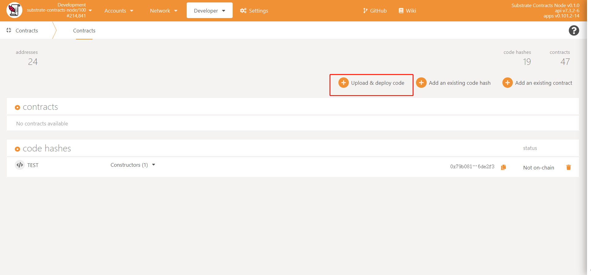

Select the ABI and WASM files that required to deploy contract, click `Upload`, and `Submit and Sign`.

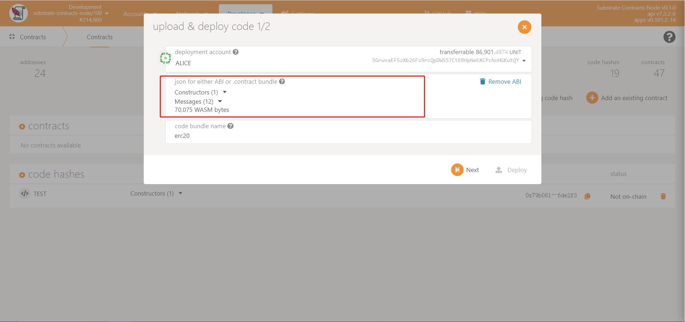

Wait a moment and the contract code will be uploaded.

### Deploy contracts

After you upload the contracts, you can instantiate the contract on the chain. In substrate, you need to perform the contract’s initialization function, usually new or the default function.

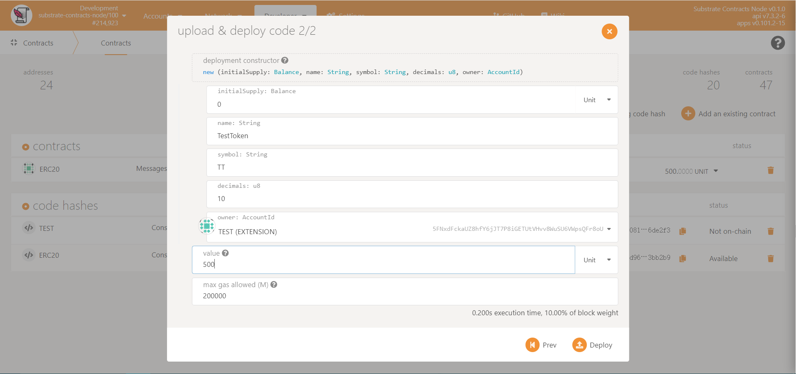

Select the initialization function call, fill in the initialization parameters, set the main contract administrator, and set the contract initial balance, click `Deploy` before set a proper endornment number, normally 500 is enough. Note that the deployment salt is used.

## Initialization

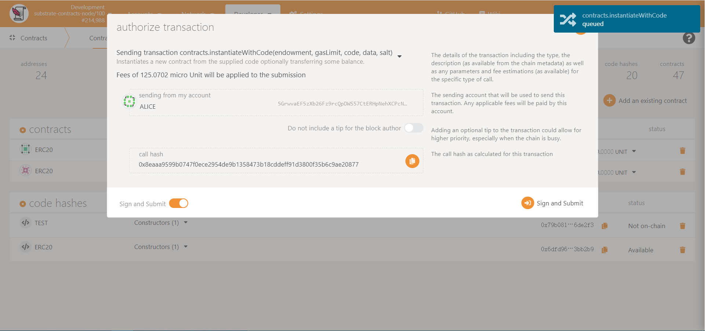


Deploy. Order(erc20 > dao_category > dao_proposal > dao_setting > dao_users > dao_vault > template_manager  > dao_manager > dao_factory)

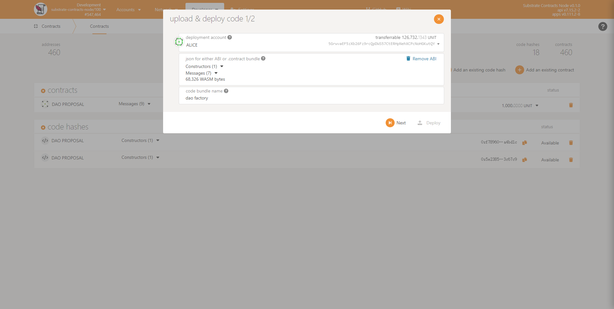

Contracts that need to pass parameters during deployment.

- erc20
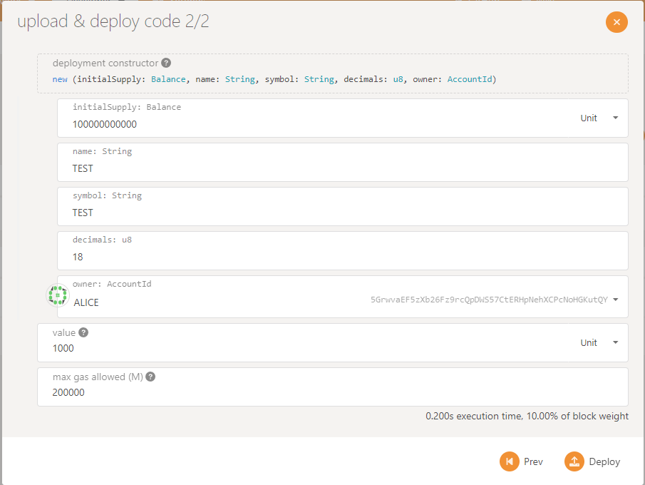
- dao_proposal
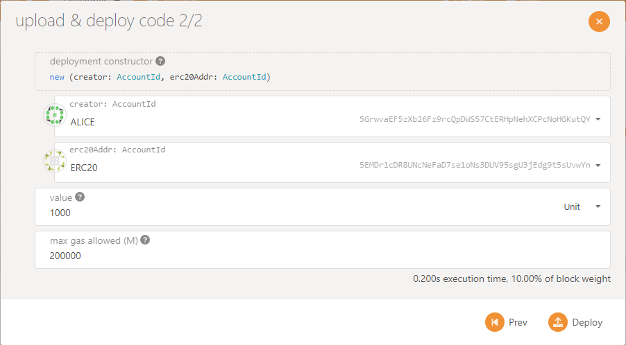
- dao_setting
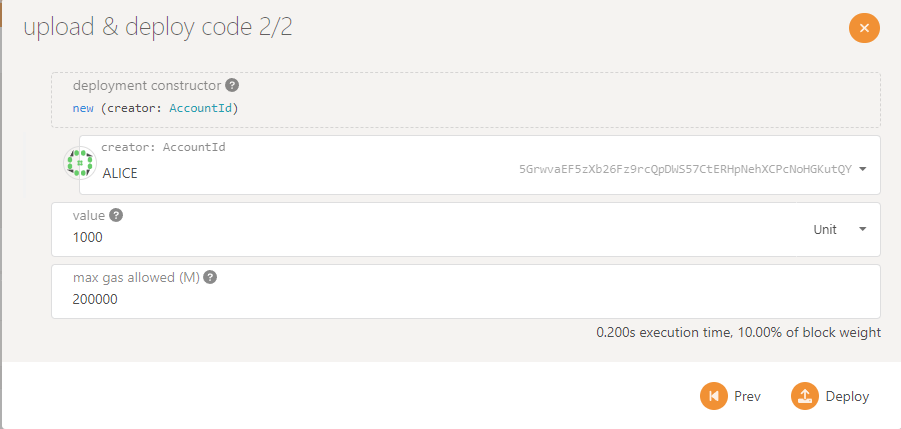
- dao_users
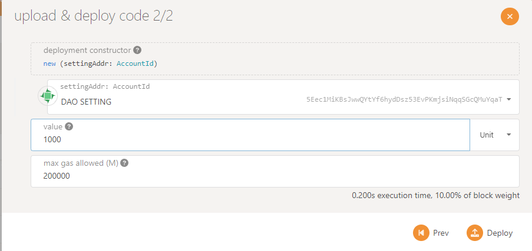 
- template_manager
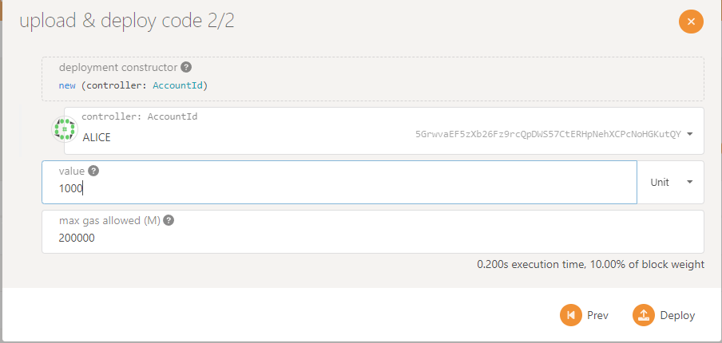
- dao_manager
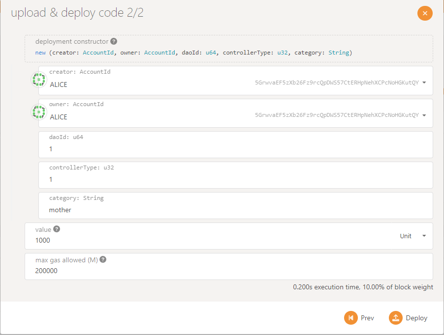

# Setup RainbowDao Protocol Front-end

## Install `Polkadot JS Extension`

Please install `Polkadot JS Extension` before you start. You can get it from here https://polkadot.js.org/extension/

### Get source code

Please get the code from `https://github.com/RainbowcityFoundation/RainbowDAO-Protocol-Ink-UI-milestone_2.git`

```
git clone https://github.com/RainbowcityFoundation/RainbowDAO-Protocol-Ink-UI-milestone_2.git
```

### Config front-end

#### 1. Replace contract address

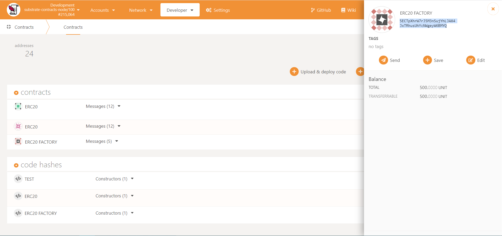

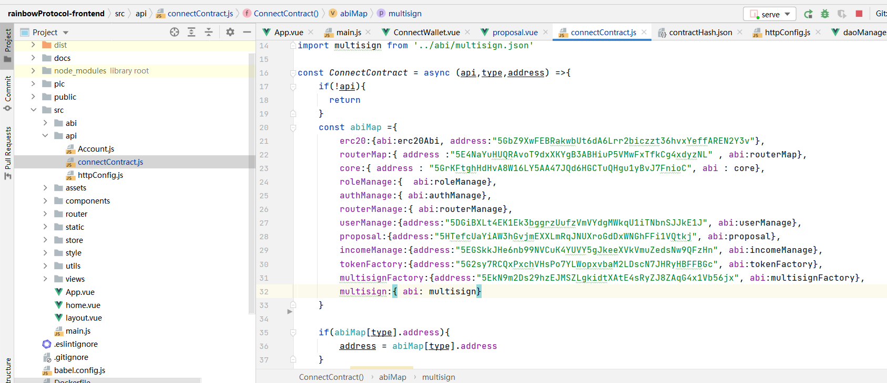

Please find the correct contract address in `src/api/connectContract.js `, and update the correct  contract address in   ``` src/api/connectContract.js ```. 

erc20 > dao_category > dao_proposal > dao_setting > dao_users > dao_vault > template_manager  > dao_manager > dao_factory

```js
//Configuration required to run this site (https://www.rainbowdao.io/daoManage) config:
//address ink => src/api/connectContract.js
dao_factory => dao_factory
//contractHash ink=> utils/contractHash.json
erc20 => erc20_code_hash
dao_proposal => dao_proposal
dao_setting => dao_setting
dao_users => dao_user
dao_vault => dao_vault
dao_manager => dao_manage
```


#### 2. Replace Hash 

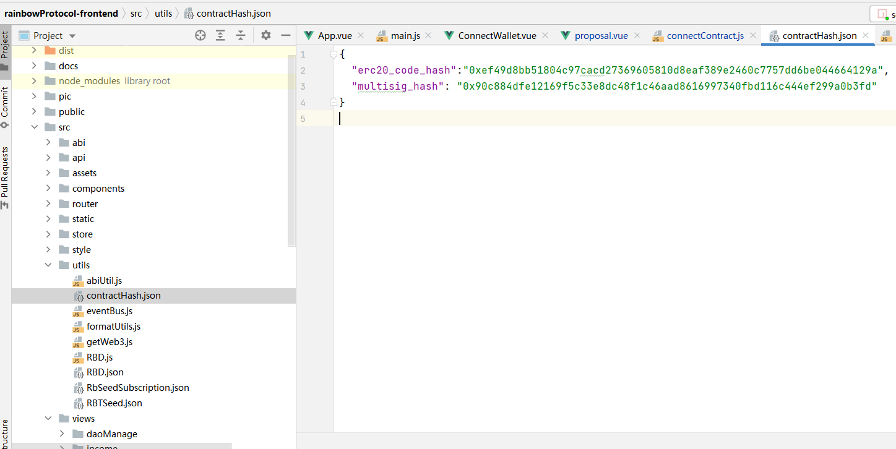

Please replace hash in `sec/utils/contractHash.json`

#### 3. Replace connect path

And replace `src/api/httpConfig.js connectPath` to your connect path.

it should be `ws://127.0.0.1:9944` by default.

Please find the correct contractHash for `` src/utils/contractHash.json ``, and update the correct address in   `src/utils/contractHash.json`.


### Install dependencies

Run `npm install` to install packages needed for this App.

### Start front-end

`npm run serve` runs the app in the development mode.
Open http://localhost:8080 to view it in the browser.


## Way 2: Use the online version front-end test  deployed contract

##### entrance:

`https://www.rainbowdao.io/polkadot`

## Install `Polkadot JS Extension`

Please install `Polkadot JS Extension` before you start. You can get it from here https://polkadot.js.org/extension/

##### Get gas from ALICE

In `https://polkadot.js.org/apps` Account page, use account  send gas to your extension account.

##### Then

You can use `https://www.rainbowdao.io/polkadot`.  Test  Protocol Management.
